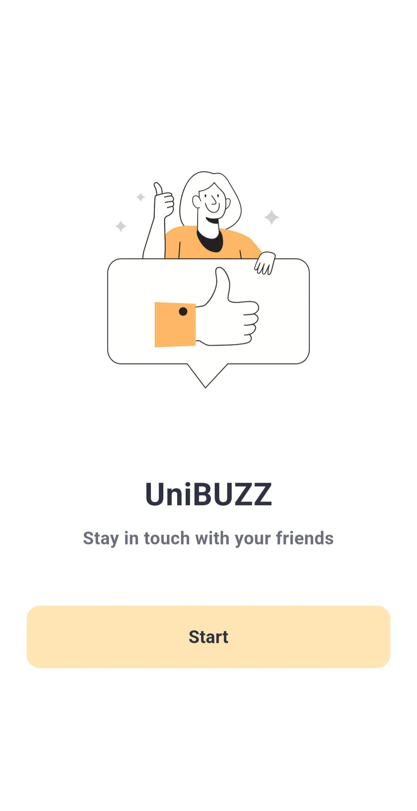
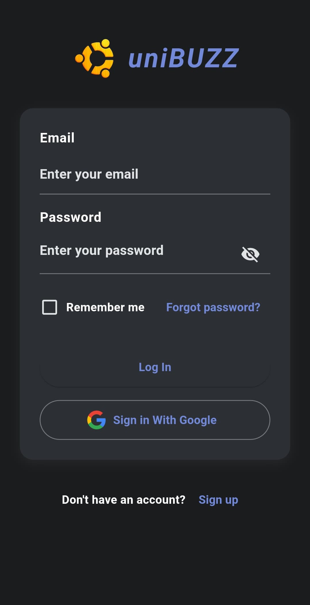
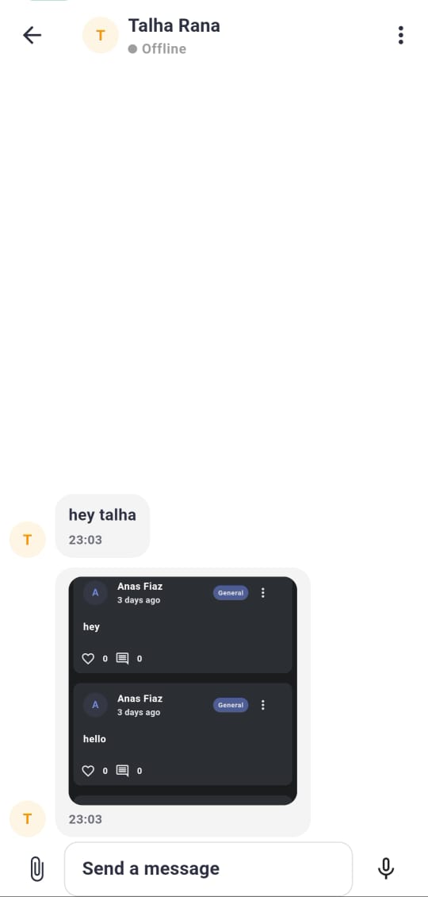
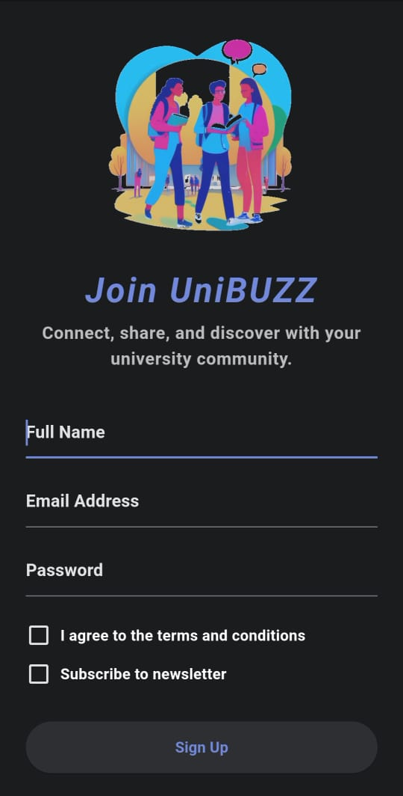

# UniBuzz Community

<p align="center">
  
</p>

<p align="center">
  <a href="https://flutter.dev"></a>
  <a href="https://dart.dev"></a>
  <a href="https://github.com/Realistic-Talha/unibuzz_community/blob/master/LICENSE"></a>
  
  
</p>

## 📋 Table of Contents
- [About](#-about-unibuzz-community)
- [Features](#-features)
- [Screenshots](#-screenshots)
- [Getting Started](#-getting-started)
- [Architecture](#️-architecture)
- [Technologies](#-technologies-used)
- [Firebase Setup](#-firebase-setup)
- [Roadmap](#-roadmap)
- [Contributing](#-contributing)
- [License](#-license)
- [Contact](#-contact)
- [Acknowledgments](#-acknowledgments)

## 📱 About UniBuzz Community

UniBuzz Community is a mobile application designed to connect university students through a vibrant digital community platform. Share posts, organize events, report lost & found items, and collaborate with fellow students - all in one place!

## ✨ Features

- **Community Posts**: Share updates, questions, and content with your university community
- **Event Management**: Create, discover, and join university events
- **Lost & Found**: Report found items or search for lost belongings
- **Personalized Profiles**: Customize your profile and connect with fellow students
- **AI-Powered Features**: Smart categorization and tag suggestions powered by Hugging Face models
- **Dark & Light Mode**: Customizable UI for comfortable viewing
- **Real-time Updates**: Get instant notifications for relevant activity
- **Offline Support**: Basic functionality available without internet connection

## 📸 Screenshots

<p align="center">
  
  
  
  
</p>

## 🚀 Getting Started

### Prerequisites

- Flutter 3.0.0 or higher
- Dart 3.0.0 or higher
- Android Studio / VS Code
- Git

### Installation

1. Clone this repository
```bash
git clone https://github.com/Realistic-Talha/unibuzz_community.git
```

2. Navigate to the project directory
```bash
cd unibuzz_community
```

3. Set up environment variables
```bash
cp .env.template .env.local
```
Edit `.env.local` with your own API keys and credentials

4. Install dependencies
```bash
flutter pub get
```

5. Run the app
```bash
flutter run
```

## 🏗️ Architecture

The app follows a clean architecture pattern with:
- **Models**: Data structures
- **Providers**: State management using Provider
- **Screens**: UI components
- **Services**: Backend integrations
- **Widgets**: Reusable UI elements

See our [detailed architecture documentation](docs/ARCHITECTURE.md) for more information.

## 🔧 Technologies Used

- **Flutter**: UI framework
- **Firebase**: Authentication, Cloud Firestore, Storage
- **Provider**: State management
- **Hugging Face API**: AI-powered features
- **Supabase**: Backend services

## 🔥 Firebase Setup

1. Create a new Firebase project at [firebase.google.com](https://firebase.google.com)
2. Add Android and iOS apps to your Firebase project
3. Download the configuration files:
   - `google-services.json` for Android
   - `GoogleService-Info.plist` for iOS
4. Place these files in their respective app folders
5. Enable Authentication, Firestore, and Storage in the Firebase console
6. Set up Firestore security rules for your collections

## 🗺️ Roadmap

- [ ] Chat functionality between users
- [ ] Campus-specific communities
- [ ] Faculty directory and office hours
- [ ] Integration with university calendars
- [ ] Study group formation tool
- [ ] Resource sharing library
- [ ] Course reviews and ratings

## 👥 Contributing

Contributions are welcome! Please check out our [contributing guidelines](CONTRIBUTING.md).

## 📄 License

This project is licensed under the MIT License - see the [LICENSE](LICENSE) file for details.

## 📞 Contact

For questions or support, please reach out to [talhayameen98@gmail.com](mailto:talhayameen98@gmail.com)

## 🙏 Acknowledgments

- Flutter team for the amazing framework
- Firebase for the powerful backend services
- All contributors who have helped shape this project
- University partners for their valuable feedback and support
